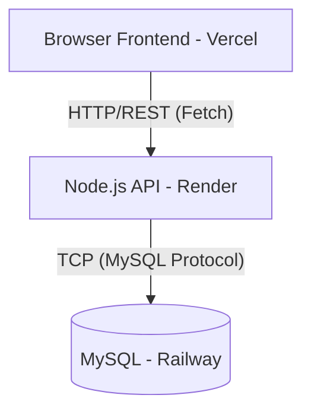
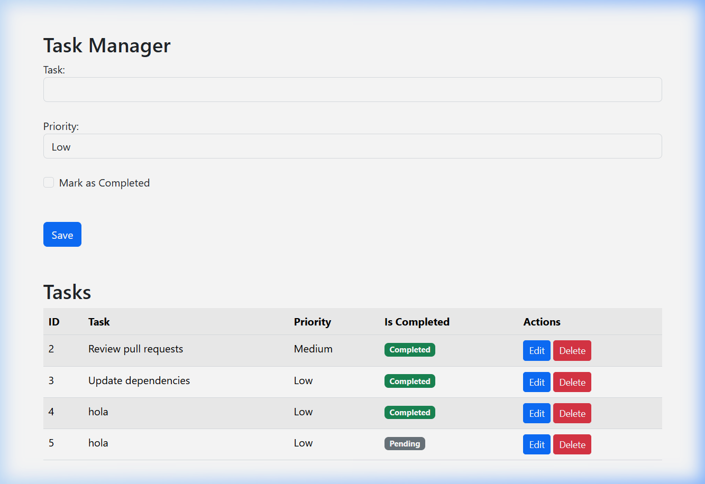
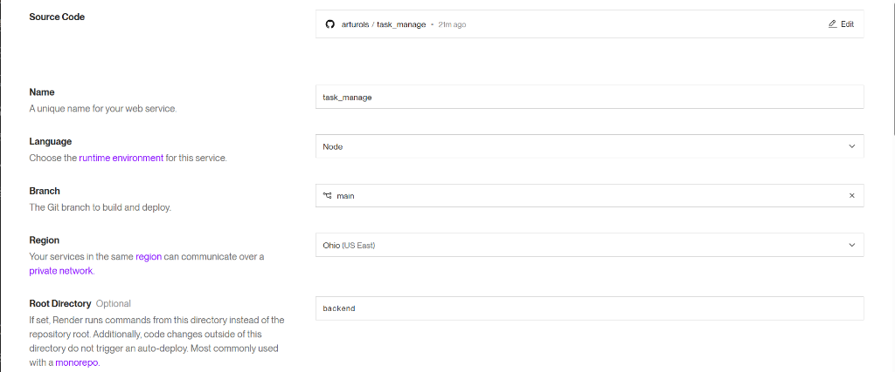

# Technical Documentation: Task Manager Full-Stack Deployment

## 1. Platform Selection Justification

For this project, we selected a multi-cloud approach to optimize for cost, performance, and specific service strengths:

| Component | Platform | Justification |
| :--- | :--- | :--- |
| **Frontend** | **Vercel** | Superior performance for static files, seamless GitHub integration, and automatic SSL. |
| **Backend** | **Render** | Excellent support for Node.js Web Services, automatic deployments, and easy environment variable management. |
| **Database** | **Railway** | Quick MySQL provisioning with "Public Networking" capabilities, allowing external connections from Render. |

## 2. Architecture Diagram

## 3. Deployment Steps Followed

1.  **Repository Setup**: Restructured the project into `/frontend` and `/backend` directories with a root-level `package.json` for orchestration.
2.  **Database Provisioning**: Created a MySQL instance on Railway and imported the `database.sql` schema.
3.  **Backend Deployment**: Configured a Web Service on Render pointing to the `/backend` folder.
4.  **Frontend Deployment**: Connected the repository to Vercel, targeting the `/frontend` folder.
5.  **Environment Sync**: Configured environment variables on Render to link the Backend with both the Database (Railway) and the Frontend (Vercel).

## 4. Challenges Faced and Solutions

### Challenge 1: CORS Policy Blocking
**Problem**: The browser blocked requests from Vercel to Render due to security policies.
**Solution**: Implemented a robust CORS configuration in `server.js` that dynamically accepts the `FRONTEND_URL` from environment variables, including automatic protocol detection (`https://`).

### Challenge 2: Database Connection Timeout
**Problem**: The backend could not reach the Railway database on the default port (3306).
**Solution**: Identified that Railway uses a custom external port (51971). Updated `db.js` to accept `DB_PORT` and verified the connection using the MySQL client.

### Challenge 3: Enum Mismatch
**Problem**: The "Update" button failed when changing priorities.
**Solution**: Found a mismatch between the frontend value ("Middle") and the database ENUM definition ("Medium"). Synced both to use "Medium".

## 5. Visual Evidence

### Running Application

### Deployment Settings (Example)

